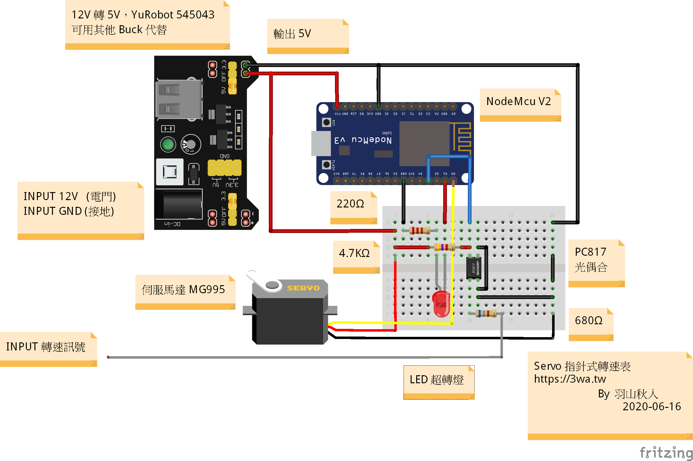

 
功能：
使用 Nodemcu V2 + Servo MG995 270° 製作轉速表 
 
作者：
羽山秋人 http://3wa.tw  
 
最初開發日期：2020-06-14 17:35 
最後更新日期：2020-06-16 12:23 
版本：V0.2 
 
說明： 
　　利用 Arduino Nodemcu 開發的伺服馬達轉速表，可以讀取 CDI 頻率，將讀到的轉速，轉換成伺服馬達要旋轉的角度，再加上超轉燈，從 8000rpm 以後至 14000rpm 亮燈。
   
接腳說明： 
　　D0 : 將訊號輸出給 Servo 
　　D1：用來連接 LED，大於 8000rpm 會有超轉燈亮起 
　　D3：PWM 接角，可以接收經過 PC817 過濾後的轉速訊號 
 
電路圖： 

 
參考影片： 
<a href="screenshot/video/1.mp4">影片 1</a> 
<a href="screenshot/video/2.mp4">影片 2</a> 
<a href="screenshot/video/3.mp4">影片 3</a> 
FZR150 自製轉速表 - Part1：https://3wa.tw/blog/blog.php?id=1856 
 
參考資料： 
1、抓取引擎訊號的二種解法： https://kokoraskostas.blogspot.com/2013/12/arduino-inductive-spark-plug-sensor.html 
  為了解決 12000rpm 以上的轉速抓取，作了一些語法的改良 
2、PC817 (光偶合器) 的使用方法： 
  機器人零件指南 / Ohmsha編著; 沈鄉吟譯  
  也可以使用 TLP621、TLP 421 
  http://wyj-learning.blogspot.com/2017/10/arduino-04pc817.html 
  或參考 小老婆機車資訊網，尋找 killPeople 大大分享的 8051 轉速表的文章 
3、呼吸燈： 
  http://web.htjh.tp.edu.tw/B4/106iot/NodeMCU%E4%BD%BF%E7%94%A8%E4%BB%8B%E7%B4%B9.pdf 
4、Gensou 的 呼吸燈影片教學 
  https://www.youtube.com/watch?v=27GkMk8ct0s 
